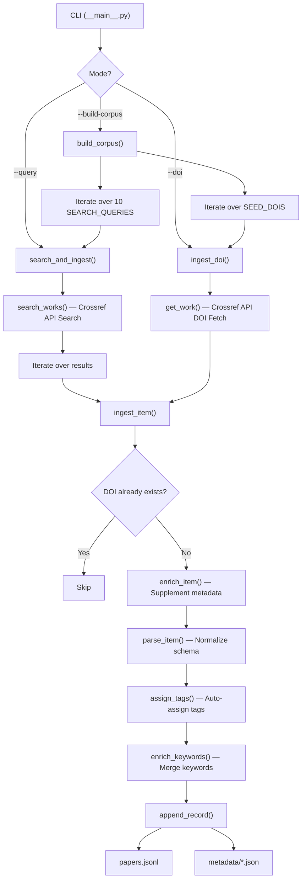

# 📊 Literature Mining for Retrosynthesis Metrics Literature and RAG Explorer

## 1. Project Overview

**Objective:** Build an automated **Literature Mining** toolkit using the Crossref API, focused on **retrosynthesis evaluation metrics**, to create a mini-corpus for a domain-specific **RAG (Retrieval-Augmented Generation) Q&A** system.

**Current Status:** Completed **Module 1 — Literature Mining (Data Extraction)**.

---

## 2. Project Structure

```text
Literature-downloader/
├── literature_mining/          # Module 1 — Crossref data mining
│   ├── __init__.py             # Package declaration, version 0.1.0
│   ├── __main__.py             # CLI entry point (84 lines)
│   ├── config.py               # System configuration (40 lines)
│   ├── crossref_client.py      # Crossref API client (193 lines)
│   ├── tagger.py               # Automatic tagging (95 lines)
│   └── corpus_builder.py       # Corpus builder (166 lines)
├── data/
│   ├── papers.jsonl            # Main corpus — 114 papers (~92 KB)
│   └── metadata/               # Per-paper JSON files (114 files)
├── requirements.txt            # 4 dependencies
└── README.md                   # Documentation
```

**Total source code:** ~578 lines of Python

---

## 3. Detailed Module Analysis

### 3.1. `config.py` — System Configuration

| Parameter           | Value                            | Description                                      |
| ------------------- | -------------------------------- | ------------------------------------------------ |
| `CONTACT_EMAIL`     | `qtle@connect.ust.hk`           | Contact email (Crossref polite pool compliance)   |
| `CROSSREF_API_BASE` | `https://api.crossref.org/works` | Crossref REST API endpoint                        |
| `ROWS_PER_QUERY`    | 20                               | Maximum results per query                         |
| `RATE_LIMIT_SEC`    | 1.0 seconds                     | API call rate limit                               |
| `MAX_RETRIES`       | 3                                | Number of retries on error                        |
| `RETRY_BACKOFF_SEC` | 5.0 seconds                     | Wait time between retries                         |

**10 Default Search Queries (`SEARCH_QUERIES`):**
1. `"single-step retrosynthesis"`
2. `"round-trip accuracy retrosynthesis"`
3. `"retrosynthesis coverage diversity"`
4. `"PaRoutes retrosynthesis"`
5. `"retrosynthesis benchmarking"`
6. `"retrosynthesis route metrics"`
7. `"failure modes one-step retrosynthesis"`
8. `"computer-aided synthesis planning evaluation"`
9. `"multi-step retrosynthesis evaluation metrics"`
10. `"synthetic accessibility score retrosynthesis"`

**Seed DOIs:** `10.1039/C9SC05704H` (Schwaller et al. 2020 — Molecular Transformer)

---

### 3.2. `crossref_client.py` — Crossref API Client (193 lines)

This is the **core module** for interacting with the Crossref REST API.

#### Main Functions:

| Function                       | Description                                                           |
| ------------------------------ | --------------------------------------------------------------------- |
| `normalize_doi(doi)`           | Normalize DOI: strip URL prefix, convert to lowercase                 |
| `strip_abstract_xml(raw)`      | Remove JATS/HTML tags from abstracts (using BeautifulSoup + lxml)     |
| `_extract_year(item)`          | Extract publication year from multiple date fields                    |
| `_extract_authors(item)`       | Extract author list (given + family name)                             |
| `_pick_link(links)`            | Select the best link (priority: text-mining > PDF > HTML)             |
| `_request(url, params)`        | HTTP GET with retry logic + HTTP 429 (rate limit) handling            |
| `search_works(query, rows)`    | Search papers by keyword (filtered from 2018 onwards)                 |
| `get_work(doi)`                | Fetch full metadata by DOI                                            |
| `enrich_item(item)`            | Supplement metadata when abstract is missing from search results      |
| `parse_item(item, query_hit)`  | Convert raw Crossref data → project's standardized schema             |

#### Key Technical Features:
- **Polite API access:** Uses User-Agent header with contact email
- **Rate limiting:** Automatically waits 1 second between requests
- **Auto-retry:** Automatically retries up to 3 times on HTTP 429 or network errors
- **Backoff strategy:** Progressively increasing wait times (5s, 10s, 15s)
- **Date filter:** Only retrieves papers from 2018 onwards (`filter: from-pub-date:2018`)

---

### 3.3. `tagger.py` — Automatic Keyword-Based Tagging (95 lines)

A **rule-based tagging** system that classifies papers into 6 topic groups:

| Tag                     | Trigger Keywords (Patterns)                                           |
| ----------------------- | --------------------------------------------------------------------- |
| **single-step metrics** | single-step, one-step, top-k, top-1, top-10, round-trip               |
| **route metrics**       | route, multi-step, pathway, paroutes, route-level, synthesis planning |
| **failure modes**       | failure mode, incorrect, error analysis, quantifying the failure      |
| **benchmarking**        | benchmark, benchmarking, evaluation, comparison, uspto                |
| **coverage diversity**  | coverage, diversity, class diversity                                  |
| **accessibility**       | synthetic accessibility, sa score, sc score, complexity               |

#### Functions:

| Function                                             | Description                                                                    |
| ---------------------------------------------------- | ------------------------------------------------------------------------------ |
| `assign_tags(title, abstract, keywords, query_hit)`  | Assign tags by scanning keywords across title + abstract + keywords + query    |
| `enrich_keywords(existing, query_hit, tags)`         | Merge keywords from Crossref + query + tags (with deduplication)               |

---

### 3.4. `corpus_builder.py` — Corpus Builder (166 lines)

The **orchestration module** for the entire data mining and storage pipeline.

#### Main Functions:

| Function                                    | Description                                                                  |
| ------------------------------------------- | ---------------------------------------------------------------------------- |
| `load_existing_dois()`                      | Load all DOIs already present in `papers.jsonl`                              |
| `_apply_tagger(record)`                     | Apply tagger to assign tags and enrich keywords                              |
| `_save_metadata(record)`                    | Save individual JSON copy to `data/metadata/`                                |
| `append_record(record)`                     | Append one record to `papers.jsonl` + save metadata                          |
| `ingest_item(item, query_hit, existing)`    | Process one Crossref item: parse → tag → save (returns `new`/`skip`/`error`) |
| `ingest_doi(doi, existing)`                 | Fetch and ingest a single DOI                                                |
| `search_and_ingest(query, rows, existing)`  | Search + ingest all results from one query                                   |
| `build_corpus(queries, rows, seed_dois)`    | Run the **full** pipeline with all queries + seed DOIs                       |

#### Technical Features:
- **Idempotent:** Re-running does not create duplicates (DOI existence check)
- **Dual storage:** Saves both centralized (`papers.jsonl`) and individual (`metadata/*.json`) files
- **Detailed statistics:** Returns new/skip/error record counts

---

### 3.5. `__main__.py` — CLI Entry Point (84 lines)

Provides a command-line interface using `argparse`.

#### Run Modes:

| Command                 | Description                                        |
| ----------------------- | -------------------------------------------------- |
| `--build-corpus`        | Run all 10 search queries → build full corpus      |
| `--build-corpus --seed` | Same as above + include seed DOIs                  |
| `--query "..."`         | Search with a single query                         |
| `--doi 10.xxxx/xxxxx`   | Fetch and ingest a specific DOI                    |
| `--rows N`              | Set results per query (default: 20)                |
| `-v / --verbose`        | Enable detailed logging (DEBUG level)              |

---

## 4. Output Data Schema

Each line in `data/papers.jsonl` is a JSON record with the following structure:

```json
{
  "doi": "10.1039/c9sc05704h",
  "title": "Predicting retrosynthetic pathways using transformer-based models...",
  "authors": ["Philippe Schwaller", "Riccardo Petraglia", ...],
  "year": 2020,
  "journal": "Chemical Science",
  "abstract": "We present an extension of our Molecular Transformer model...",
  "link": "http://pubs.rsc.org/en/content/articlepdf/2020/SC/C9SC05704H",
  "keywords": ["doi:10.1039/c9sc05704h", "route metrics"],
  "tags": ["route metrics"],
  "source": "crossref",
  "query_hit": "doi:10.1039/c9sc05704h"
}
```

| Field       | Type         | Description                                        |
| ----------- | ------------ | -------------------------------------------------- |
| `doi`       | string       | Normalized DOI (lowercase)                         |
| `title`     | string       | Paper title                                        |
| `authors`   | list[string] | List of authors                                    |
| `year`      | int \| null  | Publication year                                   |
| `journal`   | string       | Journal/conference name                            |
| `abstract`  | string       | Abstract (HTML/XML tags removed)                   |
| `link`      | string       | Access URL (PDF preferred)                         |
| `keywords`  | list[string] | Keywords (Crossref subjects + query + tags)        |
| `tags`      | list[string] | Auto-assigned tags (one of 6 groups)               |
| `source`    | string       | Data source (always `"crossref"`)                  |
| `query_hit` | string       | Query/DOI that found this paper                    |

---

## 5. Current Data Statistics

| Metric              | Value                   |
| ------------------- | ----------------------- |
| **Total records**   | 114 papers              |
| **File size**       | ~92 KB (`papers.jsonl`) |
| **Metadata files**  | 114 individual JSON files |
| **Year range**      | 2018 – 2026             |

> [!WARNING]
> **Data quality issue:** Many records in the corpus are **not related** to retrosynthesis (e.g., "Round-Trip to America", "Round Trip to Hades", "KLM Airlines round trip ticket", "WiFi Round Trip Time"...). This is because some search queries are too general, causing Crossref to return irrelevant results. A relevance filter or improved search queries are needed.

---

## 6. Usage

### 6.1. Installation

```bash
cd Literature-downloader
pip install -r requirements.txt
```

**Dependencies:**
- `requests>=2.32.3` — HTTP client
- `beautifulsoup4>=4.12.3` — HTML/XML processing
- `lxml>=5.3.0` — Parser for BeautifulSoup
- `tqdm>=4.66.5` — Progress bar (declared but not yet used in code)

### 6.2. Commands

```bash
# 1. Build full corpus (run all 10 queries)
python -m literature_mining --build-corpus

# 2. Build corpus + include seed DOIs
python -m literature_mining --build-corpus --seed

# 3. Search with a single query
python -m literature_mining --source crossref --query "PaRoutes retrosynthesis" --rows 20

# 4. Fetch a specific DOI
python -m literature_mining --doi 10.1039/C9SC05704H

# 5. Enable verbose logging
python -m literature_mining --build-corpus -v
```

### 6.3. Verify Results

```bash
# Count papers in corpus
python -c "sum(1 for _ in open('data/papers.jsonl'))"

# View a sample record
python -c "import json; print(json.dumps(json.loads(open('data/papers.jsonl').readline()), indent=2))"
```

---

## 7. Processing Pipeline



---
